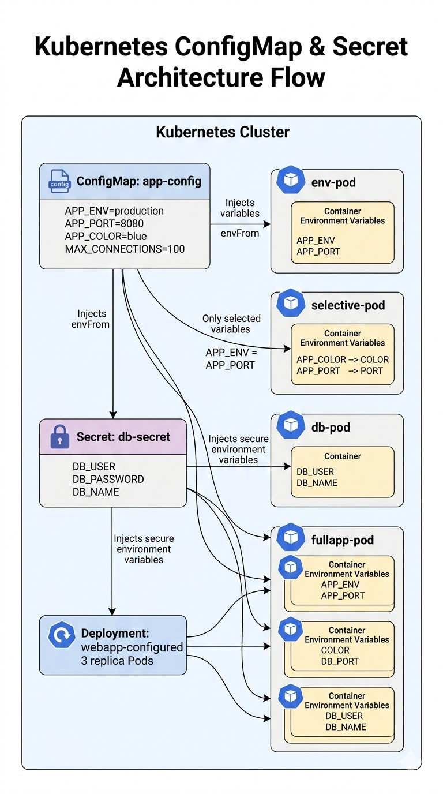

# Kubernetes ConfigMap & Secret Lab
## Environment Variables, Selective Injection, Secret Handling, and Combined Configuration



<p align="center">
  <b>Kubernetes ConfigMap & Secret Lab</b>
</p>

This lab demonstrates how **Kubernetes ConfigMaps** and **Secrets** are used to manage application configuration in a clean, reusable, and production-friendly way.

Instead of hardcoding values directly inside Pod definitions, we separated configuration into:

- **ConfigMap** for non-sensitive settings
- **Secret** for sensitive values such as database credentials

Throughout this lab, we practiced how to:

- Create and inspect a **ConfigMap**
- Inject ConfigMap values as **environment variables**
- Select specific ConfigMap keys and rename them inside a container
- Create and inspect a **Secret**
- Inject Secret values as **environment variables**
- Combine **ConfigMap + Secret** in the same Pod
- Use both of them inside a **Deployment** so all Pods receive the same configuration

The goal of the lab is to understand how Kubernetes separates **application logic**, **configuration**, and **sensitive data** in a structured and scalable way.

---

# Lab Objectives

By completing this lab you will learn how to:

- Create a **ConfigMap** using the imperative method
- Inject all ConfigMap keys using **envFrom**
- Inject selected ConfigMap keys using **env** and **configMapKeyRef**
- Create a **Secret** using the imperative method
- Understand how Secret values are stored in YAML using **Base64 encoding**
- Inject Secret values into a Pod as environment variables
- Combine **ConfigMap** and **Secret** inside the same container
- Use **ConfigMap + Secret** in a **Deployment** with multiple replicas
- Verify configuration using **kubectl logs**, **kubectl exec**, and **kubectl describe**

---

# Project Structure

```bash
K8s_Assignment_5
│
├── README.md
├── 02-configmap-as-envvars.yaml
├── 03-configmap-selective-env.yaml
├── 06-secret-as-envvars.yaml
├── 08-combined-cm-and-secret.yaml
└── 09-deployment-with-config.yaml
```

> Notes:
>
> - **Task 1** and **Task 4** were completed using the imperative method, so no YAML file was required.
> - The file names above match the lab exactly.

---

# Step 1 — Create a ConfigMap Imperatively

First, we created a ConfigMap named **app-config** using the imperative method.

This ConfigMap stored four non-sensitive application settings:

- `APP_ENV=production`
- `APP_PORT=8080`
- `APP_COLOR=blue`
- `MAX_CONNECTIONS=100`

Command used:

```bash
kubectl create configmap app-config \
  --from-literal=APP_ENV=production \
  --from-literal=APP_PORT=8080 \
  --from-literal=APP_COLOR=blue \
  --from-literal=MAX_CONNECTIONS=100
```

Verification:

```bash
kubectl get configmap
kubectl describe configmap app-config
kubectl get configmap app-config -o yaml
```

In this step, we learned that a **ConfigMap** stores configuration separately from the Pod definition, making the setup easier to update and reuse.

---

# Step 2 — Inject ConfigMap as Environment Variables

Next, we created a Pod that imports **all keys** from the ConfigMap as environment variables.

File used:

```bash
02-configmap-as-envvars.yaml
```

Pod name:

```bash
env-pod
```

Apply:

```bash
kubectl apply -f 02-configmap-as-envvars.yaml
```

Verification:

```bash
kubectl logs env-pod
kubectl exec env-pod -- env | grep APP
kubectl exec env-pod -- env | grep MAX
```

What happened:

- All ConfigMap keys were injected automatically
- The Pod received values like:
  - `APP_ENV=production`
  - `APP_PORT=8080`
  - `APP_COLOR=blue`
  - `MAX_CONNECTIONS=100`

This step demonstrated how **envFrom** loads all keys from a ConfigMap at once.

---

# Step 3 — Inject Specific ConfigMap Keys with Custom Names

In this step, we created a Pod that imports only selected keys from the ConfigMap instead of importing everything.

File used:

```bash
03-configmap-selective-env.yaml
```

Pod name:

```bash
selective-pod
```

Selected variables:

- `COLOR` ← from `APP_COLOR`
- `PORT` ← from `APP_PORT`

Apply:

```bash
kubectl apply -f 03-configmap-selective-env.yaml
```

Verification:

```bash
kubectl logs selective-pod
kubectl exec selective-pod -- env
```

Observed result:

- The Pod printed the selected values
- `MAX_CONNECTIONS` was not visible because it was not injected

This step showed that **selective injection** gives more control than `envFrom`, and also allows renaming variables inside the container.

---

# Step 4 — Create and Inspect a Secret

After working with non-sensitive configuration, we moved to sensitive data.

We created a Secret named **db-secret** to store database credentials.

Stored values:

- `DB_USER=admin`
- `DB_PASSWORD=p@ssw0rd123`
- `DB_NAME=myapp`

Command used:

```bash
kubectl create secret generic db-secret \
  --from-literal=DB_USER=admin \
  --from-literal=DB_PASSWORD='p@ssw0rd123' \
  --from-literal=DB_NAME=myapp
```

Verification:

```bash
kubectl get secret
kubectl describe secret db-secret
kubectl get secret db-secret -o yaml
kubectl get secret db-secret -o jsonpath='{.data.DB_USER}' | base64 -d
```

Key learning:

- In Secret YAML, values are stored as **Base64-encoded strings**
- Base64 is **not encryption** because it can be easily decoded

---

# Step 5 — Inject Secret as Environment Variables

Next, we created a Pod that injects Secret values as environment variables.

File used:

```bash
06-secret-as-envvars.yaml
```

Pod name:

```bash
db-pod
```

Apply:

```bash
kubectl apply -f 06-secret-as-envvars.yaml
```

Verification:

```bash
kubectl logs db-pod
kubectl exec db-pod -- env | grep DB
kubectl describe pod db-pod
```

Observed result:

- The logs showed decoded values such as:
  - `User=admin`
  - `DB=myapp`
- `kubectl exec` showed the Secret variables inside the container
- `kubectl describe pod` did not reveal the raw secret values directly

This step demonstrated that Kubernetes can inject Secret values into containers automatically while keeping them abstracted in Pod descriptions.

---

# Step 6 — Combine ConfigMap and Secret in the Same Pod

In this step, we created a Pod that uses both **app-config** and **db-secret** together.

File used:

```bash
08-combined-cm-and-secret.yaml
```

Pod name:

```bash
fullapp-pod
```

Apply:

```bash
kubectl apply -f 08-combined-cm-and-secret.yaml
```

Verification:

```bash
kubectl logs fullapp-pod
kubectl exec fullapp-pod -- env | sort
kubectl exec fullapp-pod -- env | grep -E 'APP|DB'
```

Observed result:

- ConfigMap variables appeared in one section
- Secret variables appeared in another section
- Both were available inside the same container

This step represents the common real-world pattern:

- **ConfigMap** for non-sensitive application configuration
- **Secret** for sensitive credentials

---

# Step 7 — Deployment with ConfigMap + Secret

Finally, we applied a Deployment that uses both the ConfigMap and the Secret.

File used:

```bash
09-deployment-with-config.yaml
```

Deployment name:

```bash
webapp-configured
```

Replicas:

```bash
3
```

Apply:

```bash
kubectl apply -f 09-deployment-with-config.yaml
```

Verification:

```bash
kubectl get pods -l app=webapp-configured
kubectl exec -it <any-pod> -- env | grep -E 'APP_ENV|DB_USER'
kubectl describe pod <any-pod>
```

Observed result:

- All 3 Pods were created successfully
- Each Pod received the same injected variables
- This confirms that a Deployment propagates the same configuration to all replicas automatically

This is much better than hardcoding values inside every Pod template manually.

---

# Key Learnings

## ConfigMap

A **ConfigMap** is used for non-sensitive configuration such as:

- environment name
- ports
- feature flags
- limits
- app settings

It improves flexibility because configuration stays separate from the application image.

---

## Secret

A **Secret** is used for sensitive values such as:

- usernames
- passwords
- tokens
- API keys
- private credentials

Although values are stored as Base64 in YAML, that is only an encoding format, not real protection by itself.

---

## envFrom vs Selective Injection

| Method | Behavior |
|----|----|
| `envFrom` | Imports all keys at once |
| `env` + `configMapKeyRef` | Imports specific keys only |

Use selective injection when you need more control or want custom variable names inside the container.

---

## ConfigMap + Secret Together

This is the recommended pattern for production-style applications:

- keep regular configuration in **ConfigMap**
- keep sensitive data in **Secret**
- inject both into the same container when needed

---

## Deployment Consistency

Using ConfigMap and Secret inside a Deployment ensures that all replicas receive the same configuration pattern, which improves:

- consistency
- maintainability
- reusability
- scalability

---

# Final Result

This lab demonstrated how to:

- manage application settings using **ConfigMap**
- manage sensitive credentials using **Secret**
- inject configuration into Pods as environment variables
- choose between full injection and selective injection
- combine ConfigMap and Secret in one Pod
- apply the same configuration model across multiple replicas using a Deployment

Overall, this lab shows a core Kubernetes best practice:

**Never hardcode configuration and secrets directly inside workloads when they can be managed separately in a cleaner and more scalable way.**
