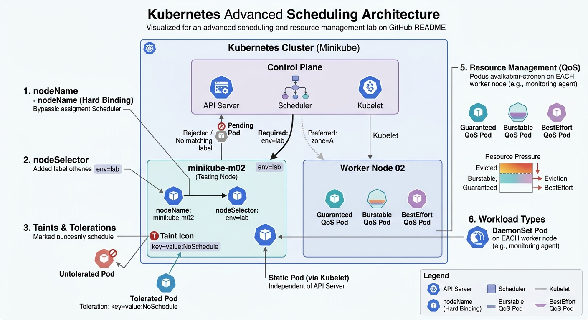

# Kubernetes Advanced Scheduling Lab
## Scheduling Strategies, QoS, DaemonSets, and Static Pods



<p align="center">
  <b>Kubernetes Advanced Scheduling & Resource Management Lab</b>
</p>

This lab demonstrates how to implement and validate advanced **Kubernetes Scheduling & Resource Management** techniques at an intermediate-to-advanced level.

Instead of relying on default scheduling behavior, we explored how to precisely control **where Pods run**, **how they behave under pressure**, and **how system workloads are distributed across nodes**.

Key concepts covered in this lab:
- **Targeted Scheduling** (nodeName & nodeSelector)
- **Taints and Tolerations**
- **Node Affinity**
- **QoS Classes (Resource Management)**
- **DaemonSets (Infrastructure workloads)**
- **Static Pods (Control Plane-level management)**

The goal of this lab is to understand how Kubernetes makes intelligent scheduling decisions and how engineers can override or fine-tune those decisions for real-world production scenarios.

---

# Lab Objectives

By completing this lab, you will learn how to:

- Force Pods onto specific nodes using **nodeName** (bypassing the scheduler).
- Schedule Pods dynamically using **nodeSelector** with labels.
- Apply **Taints** to restrict scheduling and use **Tolerations** to allow exceptions.
- Implement **Node Affinity** with both required and preferred rules.
- Understand Kubernetes **QoS Classes** and how they affect Pod eviction priority.
- Deploy cluster-wide services using **DaemonSets**.
- Create and manage **Static Pods** directly via the Kubelet.

---

# Lab Environment

- **Cluster**: Minikube (Multi-node setup)
- **Primary Worker Node**: minikube-m02
- **Tools Used**: kubectl, SSH, YAML manifests

---

# Project Structure

```bash
K8s_Advanced_Scheduling_Lab
│
├── README.md
├── task1-nodeName.yaml
├── task2-nodeSelector.yaml
├── task3-taints-tolerations.yaml
├── task4-node-affinity.yaml
├── task5-qos-demo.yaml
├── task6-daemonset.yaml
└── task7-static-pod.yaml
```

Note: Most tasks were executed using imperative commands and YAML manifests to simulate real-world troubleshooting and deployment scenarios.

---

# Key Learnings

## Targeted Scheduling
Using `nodeName` completely bypasses the scheduler, while `nodeSelector` allows dynamic placement based on labels. Misconfigured labels can leave Pods stuck in a Pending state.

## Taints & Tolerations
Think of it as a **lock-and-key mechanism**. Nodes repel unwanted Pods unless they explicitly tolerate the taint.

## Node Affinity
Provides more expressive and flexible scheduling than nodeSelector:
- **Required** = Hard rule (must match)
- **Preferred** = Soft rule (best effort)

## Resource Management (QoS)
Kubernetes assigns Pods into QoS classes:
- **Guaranteed** → Highest priority, least likely to be evicted
- **Burstable** → Medium priority
- **BestEffort** → First to be evicted under pressure

## DaemonSets
Used for infrastructure-level workloads (e.g., monitoring, logging agents). Ensures one Pod runs on every node automatically.

## Static Pods
Managed directly by the Kubelet from the node filesystem. Independent from the API Server, making them critical for control plane components.

---

# Final Result

This lab successfully demonstrated how to control and optimize Pod placement and behavior inside a Kubernetes cluster.

We moved from default scheduling to a fully controlled environment where:

- Pods can be forced or guided to specific nodes.
- Nodes can reject or accept workloads selectively.
- Scheduling logic can be fine-tuned using affinity rules.
- Resource usage directly impacts Pod survival (QoS).
- System services run reliably across all nodes (DaemonSets).
- Critical components can run independently of the control plane (Static Pods).

Mastering scheduling is essential for building resilient and production-ready Kubernetes systems.
