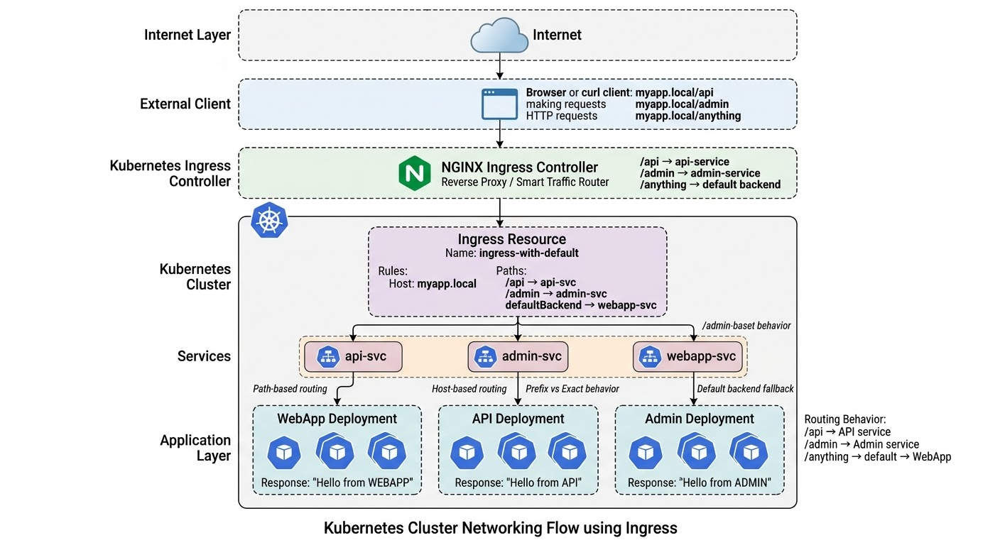

# Kubernetes Ingress Lab
## Path‑Based Routing, Host‑Based Routing, Path Types, and Default Backend



<p align="center">
  <b>Kubernetes Ingress Architecture Flow</b>
</p>

This lab demonstrates how **Kubernetes Ingress** works as a smart entry point to a cluster.  
Instead of exposing each service individually using **NodePort or LoadBalancer**, an **Ingress Controller** provides a single access point and routes traffic internally to the correct service.

Throughout this lab we built a small application environment consisting of:

- **webapp service**
- **api service**
- **admin service**

Each service responds with a simple message so we can clearly observe how traffic routing works.

The goal of the lab is to understand how **Ingress rules control traffic flow** using:

- **Path‑based routing**
- **Host‑based routing**
- **PathType behavior (Prefix vs Exact)**
- **Default backend fallback routing**

---

# Lab Objectives

By completing this lab you will learn how to:

- Deploy backend applications using **Deployments and Services**
- Configure an **NGINX Ingress Controller**
- Route traffic using **Path‑based routing**
- Route traffic using **Host‑based routing**
- Understand the difference between **Prefix** and **Exact** path types
- Configure a **default backend** for unmatched requests
- Verify routing behavior using **curl**

---

# Project Structure

```
Ingress-Lab
│
├── README.md
│
├── manifests
│   ├── 01-deployments-and-services.yaml
│   ├── 02-ingress-basic-path.yaml
│   ├── 03-ingress-host-based.yaml
│   ├── 05-ingress-path-types.yaml
│   └── 04-ingress-default-backend.yaml
```

---

# Step 1 — Enable Ingress Controller

First we enabled the **NGINX Ingress Controller** in Minikube.

```bash
minikube addons enable ingress
```

Verify the controller:

```bash
kubectl get pods -n ingress-nginx
```

Check the available IngressClass:

```bash
kubectl get ingressclass
```

Example:

```
nginx   k8s.io/ingress-nginx
```

---

# Step 2 — Deploy Backend Applications

We deployed three backend services:

- **webapp**
- **api**
- **admin**

```
manifests/01-deployments-and-services.yaml
```

```bash
kubectl apply -f 01-deployments-and-services.yaml
```

Verify deployments and services:

```bash
kubectl get deploy,svc
```

Each service responds with:

```
Hello from WEBAPP
Hello from API
Hello from ADMIN
```

---

# Step 3 — Path‑Based Routing

We created an Ingress that routes traffic based on **URL paths**.

```
manifests/02-ingress-basic-path.yaml
```

Routing rules:

| Path | Service |
|----|----|
| / | webapp-svc |
| /api | api-svc |

Apply:

```bash
kubectl apply -f 02-ingress-basic-path.yaml
```

Test:

```bash
curl --resolve "myapp.local:80:<ADDRESS>" http://myapp.local/
curl --resolve "myapp.local:80:<ADDRESS>" http://myapp.local/api
```

Result:

```
Hello from WEBAPP
Hello from API
```

---

# Step 4 — Extended Path Routing

We expanded the routing rules to include:

```
/admin -> admin-svc
```

Example tests:

```bash
curl --resolve "myapp.local:80:<ADDRESS>" http://myapp.local/admin
curl --resolve "myapp.local:80:<ADDRESS>" http://myapp.local/random
```

Because `/` uses **Prefix**, unknown paths match the root service.

Result:

```
Hello from WEBAPP
```

---

# Step 5 — Host‑Based Routing

Instead of routing by path, we routed traffic using **different hostnames**.

```
webapp.local -> webapp-svc
api.local -> api-svc
admin.local -> admin-svc
```

Apply:

```bash
kubectl apply -f 03-ingress-host-based.yaml
```

Test:

```bash
curl --resolve "webapp.local:80:<ADDRESS>" http://webapp.local
curl --resolve "api.local:80:<ADDRESS>" http://api.local
curl --resolve "admin.local:80:<ADDRESS>" http://admin.local
```

---

# Step 6 — Path Types (Prefix vs Exact)

This step demonstrates the difference between **Prefix** and **Exact** path types.

Rules:

| Path | Type | Service |
|----|----|----|
| /api | Prefix | api-svc |
| /admin | Exact | admin-svc |
| / | Prefix | webapp-svc |

Apply:

```bash
kubectl apply -f 05-ingress-path-types.yaml
```

Test:

```bash
curl --resolve "myapp.local:80:<ADDRESS>" http://myapp.local/api/users
curl --resolve "myapp.local:80:<ADDRESS>" http://myapp.local/admin
curl --resolve "myapp.local:80:<ADDRESS>" http://myapp.local/admin/settings
```

Results:

```
/api/users -> Hello from API
/admin -> Hello from ADMIN
/admin/settings -> Hello from WEBAPP
```

Explanation:

- **Prefix** matches subpaths
- **Exact** matches only the exact path

---

# Step 7 — Default Backend

Finally we configured a **default backend** to handle unmatched paths.

```
manifests/04-ingress-default-backend.yaml
```

Rules:

| Path | Service |
|----|----|
| /api | api-svc |
| /admin | admin-svc |
| default | webapp-svc |

Apply:

```bash
kubectl apply -f 04-ingress-default-backend.yaml
```

Verify:

```bash
kubectl describe ingress ingress-with-default
```

---

# Step 8 — Testing Default Backend

Test defined path:

```bash
curl --resolve "myapp.local:80:<ADDRESS>" http://myapp.local/api
```

Result:

```
Hello from API
```

Test unknown path:

```bash
curl --resolve "myapp.local:80:<ADDRESS>" http://myapp.local/anything
```

Result:

```
Hello from WEBAPP
```

Test no path:

```bash
curl --resolve "myapp.local:80:<ADDRESS>" http://myapp.local
```

Result:

```
Hello from WEBAPP
```

---

# Key Learnings

## Path‑Based Routing

Routes requests based on the **URL path**.

Example:

```
/api -> api service
/admin -> admin service
```

---

## Host‑Based Routing

Routes requests based on **hostname**.

Example:

```
api.example.com
admin.example.com
```

---

## Prefix vs Exact

| Type | Behavior |
|----|----|
| Prefix | Matches path and subpaths |
| Exact | Matches only the exact path |

---

## Default Backend

A **fallback service** that handles requests that do not match any rule.

Common real‑world uses:

- Custom **404 page**
- Maintenance page
- Catch‑all routing service

---

# Final Result

This lab demonstrated how to:

- Configure **Kubernetes Ingress**
- Route traffic using **paths and hosts**
- Control routing behavior using **path types**
- Handle unmatched traffic using a **default backend**

Ingress acts as a **smart gateway** that simplifies external access to multiple services in a Kubernetes cluster.
