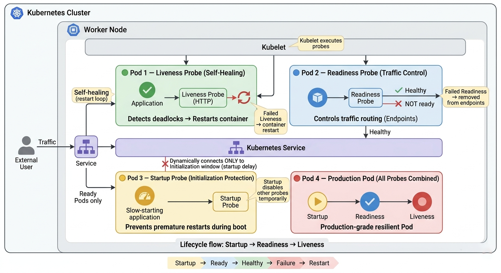

# Kubernetes Health Probes Lab
## Liveness, Readiness, Startup Probes, and Application Lifecycle



<p align="center">
  <b>Kubernetes Application Health & Resilience Lab</b>
</p>

This lab demonstrates how to implement and validate fundamental **Kubernetes Health Probes** at the CKA (Certified Kubernetes Administrator) level. 

Instead of deploying unmonitored applications prone to silent failures or dropped user requests, we applied strict health-checking mechanisms across different stages of a Pod's lifecycle:
- **Liveness Probes** to detect deadlocks and force container restarts.
- **Readiness Probes** to dynamically manage traffic and isolate unready pods.
- **Startup Probes** to protect slow-starting applications from premature termination.
- **Production-Ready Pods** combining all three mechanisms.

The goal of this lab is to understand how Kubernetes ensures **High Availability**, zero-downtime deployments, and autonomous self-healing without manual human intervention.

---

# Lab Objectives

By completing this lab, you will learn how to:
- Implement **Liveness Probes** using `HTTP GET` and `Exec Command` methods to recover from application crashes.
- Prevent routing traffic to unprepared applications by configuring **Readiness Probes**.
- Understand the difference between a Pod Restart (Liveness) and Pod Removal from Service Endpoints (Readiness).
- Use **Startup Probes** to give legacy or heavy applications sufficient time to boot (`failureThreshold` × `periodSeconds`).
- Orchestrate a fully resilient **Production Pod** that utilizes all three probes synergistically.
- Debug and verify probe configurations using Pod descriptions and Kubelet events.

---

# Project Structure

```bash
K8s_Health_Probes_Lab
│
├── README.md
├── task1-liveness-http.yaml
├── task2-liveness-exec.yaml
├── task3-readiness-deployment.yaml
├── task4-startup-probe.yaml
└── task5-production-pod.yaml
```

Note: Most tasks in this lab were executed using inline YAML definitions via `cat <<EOF | kubectl apply -f -` for speed and efficiency during testing.

---

# Key Learnings

## Autonomous Self-Healing (Liveness Probes)
Never let a frozen or deadlocked application consume resources. Use Liveness probes to continuously monitor application health. If the app stops responding, Kubernetes will forcefully restart it.

## Safe Traffic Routing (Readiness Probes)
If an application is busy processing a heavy task or lost connection to its database, it shouldn't receive user traffic. Readiness probes temporarily remove the Pod's IP from the Service Endpoints without restarting the container, preventing HTTP 502/503 errors for users.

## Graceful Initialization (Startup Probes)
Liveness probes can accidentally kill slow-starting applications before they even finish booting. Startup probes temporarily disable all other checks, giving the application a dedicated, uninterrupted time window to initialize.

## Production Synergy
In a real-world production environment, all three probes are used together:
Startup (safe boot) → Readiness (safe traffic routing) → Liveness (continuous health monitoring).

---

# Important Commands Used in the Lab

```bash
# 1. Verify Probe Configuration
kubectl describe pod <pod-name> | grep -E 'Liveness|Readiness|Startup' -A8

# 2. Simulate Application Failure (HTTP GET)
kubectl exec <pod-name> -- rm /usr/share/nginx/html/index.html

# 3. Live Monitor Pod Status & Restarts
kubectl get pods -w

# 4. Check Service Endpoints (Readiness Verification)
kubectl get endpoints <service-name>

# 5. Inspect Pod Events for Probe Failures/Restarts
kubectl describe pod <pod-name> | grep -A20 Events
```

---

# Final Result

This lab successfully demonstrated how to build resilient, production-grade applications in a Kubernetes cluster. We transitioned from unmonitored, fragile pods to a highly available environment where:

- Applications are given adequate, protected time to boot (Startup).
- Traffic is explicitly routed only to fully prepared instances (Readiness).
- Frozen or malfunctioning applications are automatically killed and restarted (Liveness).

Kubernetes reliability relies heavily on proper probe configuration. Defining resources is not enough; you must explicitly define what "Healthy" and "Ready" mean for your specific workloads.
