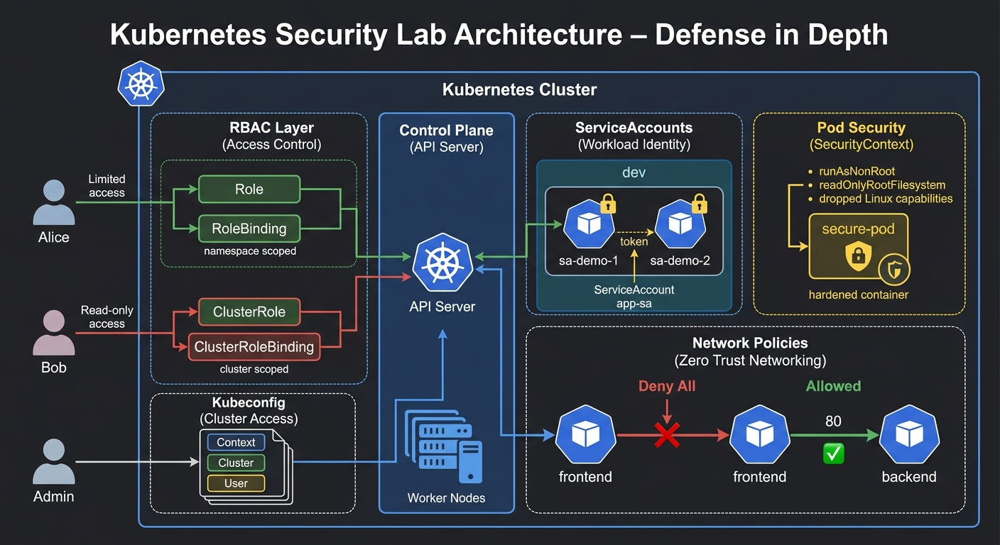

# Kubernetes Security Lab
## RBAC, ServiceAccounts, SecurityContext, Network Policies, and Kubeconfig



<p align="center">
  <b>Kubernetes Security Fundamentals Lab</b>
</p>

This lab demonstrates how to implement and validate fundamental **Kubernetes Security** mechanisms at the CKA (Certified Kubernetes Administrator) level. 

Instead of leaving a cluster open and vulnerable, we applied strict security boundaries across different layers of the Kubernetes architecture:
- **RBAC (Role-Based Access Control)** for human users (Namespaced & Cluster-wide)
- **ServiceAccounts** for workload/machine identities
- **SecurityContext** for Pod/Container hardening
- **NetworkPolicy** for internal traffic isolation
- **Kubeconfig** for managing administrative cluster access

The goal of this lab is to understand how Kubernetes enforces the **Principle of Least Privilege** across users, applications, containers, and network traffic.

---

# Lab Objectives

By completing this lab, you will learn how to:
- Grant fine-grained, namespace-scoped permissions using **Role** and **RoleBinding**.
- Grant cluster-wide permissions using **ClusterRole** and **ClusterRoleBinding**.
- Manage workload identities by creating and attaching **ServiceAccounts** to Pods.
- Inspect mounted identity tokens inside containers.
- Secure container execution using **SecurityContext** (running as non-root, read-only filesystems, and dropping Linux capabilities).
- Enforce network isolation using a **Deny-All NetworkPolicy**.
- Whitelist specific internal traffic using an **Allow-Specific NetworkPolicy**.
- Navigate and inspect the **kubeconfig** file to understand Contexts, Clusters, and Users.

---

# Project Structure

```bash
K8s_Security_Lab
│
├── README.md
├── task1-rbac-imperative.sh
├── task2-cluster-rbac-imperative.sh
├── task3-service-accounts.yaml
├── task4-secure-pod.yaml
├── task5-network-policies.yaml
└── task6-kubeconfig-inspection.sh
```

Note: Most tasks in this lab were executed using imperative commands or inline YAML definitions via `cat <<EOF | kubectl apply -f -` for speed and efficiency.

---

# Key Learnings

## Authorization (RBAC)
Never use admin credentials for everyday tasks. Use Roles for namespace-level isolation and ClusterRoles for cluster-wide administration.

## Authentication (ServiceAccounts)
Pods shouldn't use human credentials. Assign dedicated ServiceAccounts to workloads so you can trace and restrict what your applications can do via the API.

## Pod Security
Never run containers as root. Utilizing SecurityContext to enforce read-only filesystems and drop Linux capabilities severely limits the damage of container escape vulnerabilities.

## Network Security
Kubernetes networks are flat and open by default. Implementing a Deny-All NetworkPolicy and explicitly whitelisting traffic prevents lateral movement if a single microservice is compromised.

---

# Final Result

This lab successfully demonstrated how to secure a Kubernetes cluster from the inside out. We transitioned from a completely open cluster to a hardened environment where:

- Users have restricted access (RBAC).
- Pods have unique identities (ServiceAccounts).
- Containers run safely (SecurityContext).
- Microservices communicate securely (NetworkPolicies).

Kubernetes security is a multi-layered approach. Securing the perimeter is not enough; you must secure the workloads themselves.
